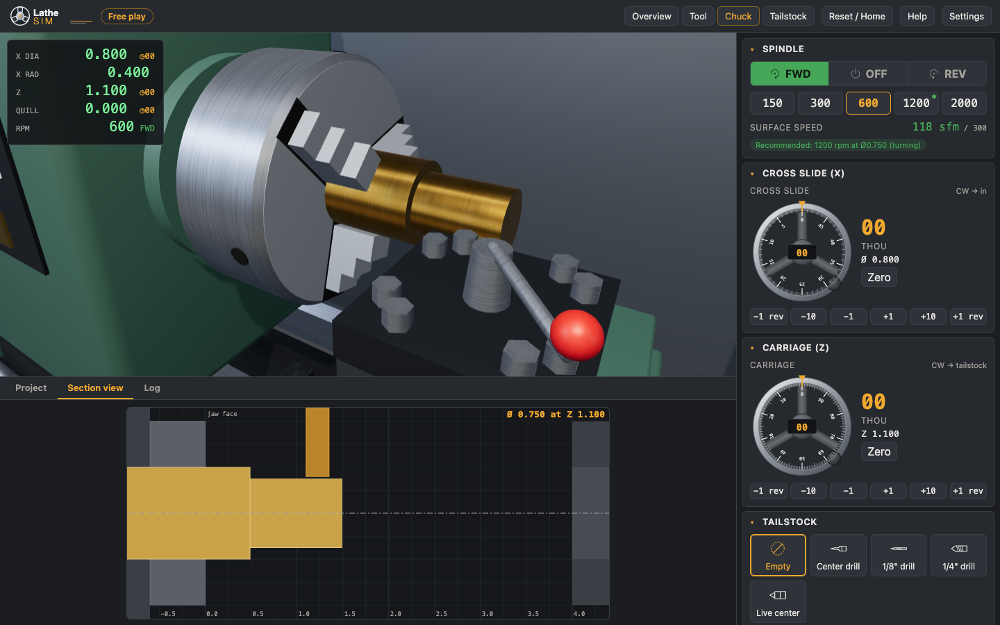

# Lathe Sim

Learn to run a small bench lathe by running one in your browser. Load a bar, mount a tool, start
the spindle and turn the handwheels to face, turn, drill and part off. Narrated **lessons** show
how each job is done, and you can watch them or do each step yourself. **Challenges** hand you a
dimensioned drawing, grade the part you make, and explain where it went wrong.




The simulation works in inches, with dials in thousandths. It models material removal on a
solid of revolution, along with crashes into the chuck or tailstock, rubbing with the spindle
stopped, heavy cuts and broken tools, chatter from too much surface speed, and poor finish from
feeding too fast. See [docs/USER_GUIDE.md](docs/USER_GUIDE.md) for how to use it.

## Stack

- Vite, React 18 and TypeScript in strict mode
- three.js with @react-three/fiber and @react-three/drei for the 3D view
- zustand for the single store that wraps the simulation engine
- CSS modules with a dark workshop theme
- Vitest and Testing Library for unit and component tests, Playwright (Chromium) for end-to-end tests

## Scripts

```sh
npm install
npm run dev            # dev server at http://localhost:5173
npm run build          # type-check, then production build into dist/
npm run preview        # serve dist/
npm run typecheck
npm run lint
npm test               # unit and component tests (vitest)
npm run test:coverage  # the same, with v8 coverage and thresholds
npm run test:e2e       # Playwright: builds, serves on :4173, runs e2e/
```

The first time you run the end-to-end tests, install the browser:

```sh
npx playwright install chromium
```

## Project structure

```
src/
  engine/    pure TypeScript simulation: workpiece, tools, physics, LatheEngine,
             ScriptPlayer, grader, mistake analyzer, hints. No React, no three.
  content/   lessons and challenges as typed data, with reference solutions
  art/       SVG icons and logo, procedural canvas textures
  store/     zustand store wrapping the engine and the script player
  scene/     the 3D lathe (React Three Fiber), lazily loaded
  ui/        controls: handwheels, spindle, toolpost, tailstock, stock, DRO,
             section view, part drawing, toasts, event log
  projects/  home screen, lesson player, challenge panel, grade card
  app/       app-shell helpers: settings, fallback ticker, header menus
  App.tsx    layout: header, 3D view with overlays, bottom tabs, control panel
e2e/         Playwright tests
docs/        DESIGN.md (the contract), DECISIONS.md, USER_GUIDE.md, screenshots
```

[docs/DESIGN.md](docs/DESIGN.md) is the design contract. [docs/DECISIONS.md](docs/DECISIONS.md)
records the choices made where the design was silent.

## How it fits together

- `LatheEngine` holds the machine state and applies actions such as `turnHandwheel`, `setSpindle`
  and `loadStock`. Each handwheel move is applied in sub-steps of 0.002" or less, so long moves
  carve the right path.
- The store's `tick(dt)` advances the engine and any playing lesson. The 3D scene calls it from
  its single frame loop. When the 3D view is off, or WebGL is missing, the app shell runs its own
  `requestAnimationFrame` ticker instead.
- three.js and React Three Fiber are loaded on demand, so the controls appear before the 3D view
  has downloaded.

## Testing

- **Unit and component tests** (`npm test`) cover the engine in depth. Every challenge's
  reference solution is run and must pass grading, and every lesson is played and must not crash.
  The UI controls, the project panels and the app shell are tested with Testing Library.
  Coverage thresholds are 90% lines for the engine and 75% overall.
- **End-to-end tests** (`npm run test:e2e`) drive the production build in Chromium. WebGL comes
  from SwiftShader, so no GPU is needed. They cover:
  - app load, the 3D canvas, and the no-3D fallback;
  - free play: facing and turning with the handwheel buttons, checked against the DRO and the
    section view;
  - a watched lesson that plays to the end, and a do-it-yourself lesson;
  - "Show me" in a do-it-yourself lesson, with the controls locked while it plays;
  - the do-it-yourself instruction staying in view at 1100×800, 1280×720 and 1440×900;
  - the Pin challenge, both passing and failing undersize;
  - "Show solution": pausing, changing speed and taking over;
  - a crash into the chuck jaws;
  - a few seconds of cutting with the 3D view on.

  Every test fails if the page logs a console error or throws. That includes a 3D scene that
  fails, because the scene's error boundary reports through `console.error`. The screenshot test
  regenerates the images above. The test server is always built fresh. Set `E2E_REUSE_SERVER=1`
  to reuse a server you started yourself. Set `E2E_GPU=1` to use your installed Chrome and GPU,
  which is how the screenshots are made.

For speed and determinism, most end-to-end tests open the app with `?no3d=1`, which turns the
3D view off. `?e2e=1` exposes the store as `window.__lathe`, so tests can make long traverses
without hundreds of clicks. The store handle is always on in dev mode.
