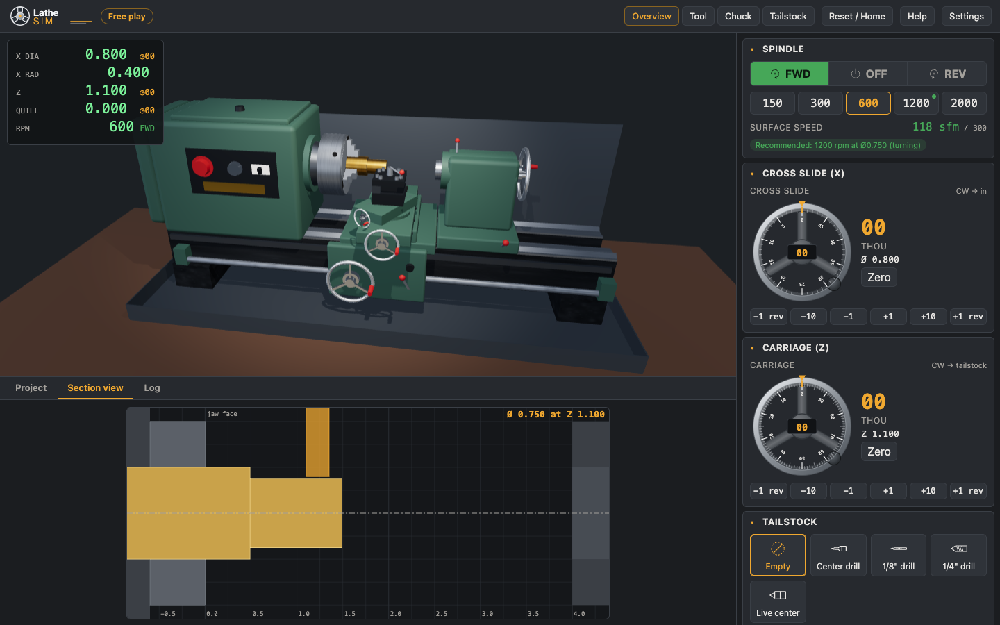

# Lathe Sim user guide

Lathe Sim is a small bench lathe (think of a 7x14 mini lathe) that runs in your browser. You learn by
doing: load a bar, mount a tool, start the spindle and turn the handwheels. Lessons show you how
each job is done. Challenges give you a drawing and grade the part you make.

All dimensions are in **inches**. Dials read in **thousandths** ("thou", 0.001").

## The screen

- **Header.** The mode badge shows where you are: free play, a lesson, or a challenge. The camera
  buttons (Overview, Tool, Chuck, Tailstock) move the 3D view. **Reset / Home** gives you a fresh
  machine and takes you back to the home screen. **Help** sums up the controls. **Settings** can
  turn the 3D view off.
- **3D view.** Drag to orbit, scroll to zoom, right-drag to pan. Choosing a camera preset glides
  back to it, even if it is already selected. **Tool** looks at the tool tip from the front right,
  a little above, and keeps following the tip as the carriage and cross slide move. If you orbit
  away in the Tool view, your view is carried along with the tool. If the 3D view runs slowly, a
  note offers to turn it off.
- **DRO (digital readout), top left.** It shows X as a diameter (**X dia**) and as a radius
  (**X rad**). It also shows the carriage position **Z**, the tailstock **Quill**, and the spindle
  speed and direction. The small ◷ numbers are the dial collar readings in thou. Badges appear when
  the tool is cutting, after a crash, or when the tool is broken.
- **Toasts, top right.** These are short warnings for things like a crash, chatter, rubbing, a
  heavy cut, a poor finish, or a part dropping off. They fade after a few seconds. Screen readers
  announce crashes and broken tools at once, and the rest politely.
- **Locked controls.** While a demo drives the machine, a banner above the control panel says so
  and the controls are disabled. Its **Take over** button gives you the controls back (see
  Lessons and Challenges).
- **Bottom tabs.**
  - **Project** holds the home screen, the lesson player, or the challenge panel.
  - **Section view** is a 2D cut through the work, the tool, the chuck jaws and the tailstock. It
    reads out the diameter at the tool. It is the best way to see exactly what you are cutting.
  - **Log** lists every event with its time. Tick "Show cut events" to see each cut too.
- **Control panel, right.** It has sections for the spindle, cross slide, carriage, tailstock,
  toolpost and stock. Click a section title to fold it away. On a narrow window the panel moves
  below the 3D view.

## Coordinates

- **Z** runs along the spindle. Z = 0 is the front face of the chuck jaws. Positive Z points toward
  the tailstock.
- **X** is the tool's distance from the spindle axis, which is a radius. The DRO shows it doubled
  as **X dia**, because machinists think in diameters.

## Controls

### Spindle
- **FWD / OFF / REV** is the motor switch. With the keyboard, the arrow keys move along the
  switch and along the RPM buttons. Normal cutting is FWD. A right-hand tool cutting in
  REV is flagged.
- **RPM** can be 150, 300, 600, 1200 or 2000.
- The **surface speed** readout shows how fast the work moves past the tool, in feet per minute
  (SFM). Too fast and the tool chatters. It shows a recommended RPM for the current diameter and
  tool. Parting needs about half the speed of turning, and the recommendation for parting never
  goes above 300 rpm, which is what every lesson and hint uses.

### Handwheels (cross slide X, carriage Z, tailstock quill)
There are several ways to turn a handwheel:

- **Drag** around the wheel. Each division is one thou of travel.
- **Mouse wheel** over the wheel turns one division per notch. Scrolling down is clockwise. Hold
  **Shift** for ten.
- **Keyboard.** Click or Tab to the wheel, then use **→** or **↑** (clockwise), or **←** or **↓**,
  for one division. Hold **Shift** for ten. **Page Up** and **Page Down** (or **Alt** with an
  arrow) turn a whole revolution.
- **Buttons** under the wheel: −1 rev, −10, −1, +1, +10, +1 rev. Plus is clockwise. Hold a
  button down to repeat.
- **How fast you feed.** A single button press, key press or wheel notch counts as a steady,
  careful turn, so stepping through a cut never spoils the finish. Dragging and holding a button
  count at the speed you really move. Holding **+1 rev** in a cut feeds far too fast and is
  flagged as a poor finish.
- **Zero** sets the dial collar to 00 where you are, so you can count thou from there.

Which way things move:

| Handwheel | Clockwise does | One revolution |
|---|---|---|
| Cross slide (X) | moves the tool **in**, toward the center | 0.050" of radius, which is 0.100" off the diameter |
| Carriage (Z) | moves the carriage **toward the tailstock** | 0.100" |
| Tailstock quill | **advances** the quill toward the work | 0.100" |

Counter-clockwise on the carriage moves toward the chuck. That is the direction you feed when
turning.

### Tailstock
Pick an empty quill, a center drill, a 1/8" or 1/4" drill, or a live center. Then use the quill
handwheel to feed it. Drills only cut with the spindle running.

### Toolpost
Mount the **turning** tool (facing and turning), the **parting** blade, the **boring** bar, or
nothing. Stop the spindle before you change tools. The panel warns you if you don't.

### Stock
Choose a preset or type in the material (brass, aluminum, steel or Delrin), diameter, length and
stick-out. Stick-out is how far the bar protrudes from the jaws. At least 0.375" must stay in the
jaws. Then press **Load**. **Remove**
takes the bar out. When you part a piece off, **Collect part** moves it into your inventory. In a
challenge there is also a "Challenge stock" preset.

## Lessons

Open the **Project** tab on the home screen. Each lesson has two buttons:

- **Watch** plays a narrated demo. Use the transport buttons to play, pause, step forward and
  restart. The speed buttons play from 0.5× up to 8×. Click any step in the list to jump to it.
  The controls are locked while the demo plays. Pause it, or press **Take over** on the banner,
  to use them. Pausing or taking over puts each slide on the nearest dial division. When you
  press Play again, the demo carries on from wherever you left the machine: its moves go to fixed
  positions, not fixed numbers of turns. If you moved or cut anything while it was paused, a
  notice says so, for example where the face is now. The end of the lesson says "completed with
  deviations" and lists any step that did not come out as narrated.
- **Do it yourself** describes each step, and you do it with the controls. The current step sits
  at the top of the panel:
  - its title and what to do;
  - a **Waiting until** line, which is exactly what the step checks;
  - the moves, worked out from where the machine is now, with the DRO target, the dial reading
    at the target and how many turns get you there.

  A step ticks off as soon as the machine is in the right state, and the lesson moves on. A step
  that is already true when you reach it says "Already done" and moves on by itself after a
  moment. **Show me** plays the current step on the machine at the **Show me speed**, from
  wherever the tool is. The controls are locked while it plays, and **Stop the demo** ends it.
  Stopping a demo part-way puts the slides on the nearest dial division. **Skip step** / **Next**
  moves on without doing it. The step list on the right shows your progress. Click a step to go
  back and read it again. If you skipped any steps, the end of the lesson lists them.
- **Narration and moves.** The narration quotes the readings of the demo, such as "the
  micrometer reads 0.990". If your skim came out a little different, go by the moves listed under
  the step: they are worked out from your own position and dial zero. Count whole turns, then
  finish on the dial number or the DRO.
- **Watch instead** / **Do it yourself** switches modes at the step you are on. The machine is
  set up as the lesson has it at the start of that step.

The lessons, in order:

1. **Machine Tour.** Name the parts, move each handwheel, zero a dial, and start and stop the
   spindle.
2. **Facing.** Square up the end of a bar. Approach from outside, cut past center, never rub.
3. **Turning.** Turn 1.000" down to 0.750" with roughing and finishing passes.
4. **Drilling.** Center drill, then peck-drill a 1/4" hole half an inch deep.
5. **Parting Off.** Cut a 1" piece off the bar at low speed.
6. **Full Project: Bushing.** Face, turn, drill and part a brass bushing from start to finish.

## Challenges

Each challenge shows the stock and a dimensioned drawing. First press **Load this stock**, then
make the part.

- **Hint** suggests the next step. Ask again for a numbered list of moves, worked out from where
  your machine is now: DRO targets, dial readings and turns. A turning or facing step comes as one
  line per pass ("Pass 4 of 8: ..."), and passes that would only cut air are left out. If a step
  can't be done any more, for example the bar is already under size, the hint says so and moves on
  to what you can still do: usually part it off, check it to see your grade, then Try again.
- **Check my part** measures your part against the drawing. It gives a score and a pass or fail,
  with a table of checks. "Where it went wrong" explains any mistakes: undersize, oversize, wrong
  length, not parted, crashes, rubbing, heavy cuts, chatter, poor finish, and skipped steps.
- **Show solution** asks first, then resets your work and plays the reference solution. It has
  the same transport as a watched lesson: Play / Pause, Step forward, the speed buttons, the
  current step with its narration, and a progress bar. **Take over** stops the solution where it
  is and hands you the machine, so you can finish the part yourself. A grade taken after a
  solution notes that the solution made some of the part.
- **Try again** starts over. It asks first if you have done any work. **Exit** goes back home.
- **The drawing.** The faced end is on the right. Lengths without a tolerance, such as shoulder
  positions, are held to ±0.010". A part that stays in the chuck, like the Faced Slug, shows the
  jaws, and its length is measured from them.

| Challenge | Difficulty | Make |
|---|---|---|
| Faced Slug | ★ | Face the end of the bar clean. No parting. |
| Pin | ★ | 0.500" ±0.005 × 1.000" ±0.010 long, parted off. |
| Stepped Shaft | ★★ | 0.500" × 0.750" long at the faced end, then 0.750" × 0.500" long, 1.250" overall, parted. |
| Spacer | ★★ | 0.625" OD × 0.250" thick, parted. There is very little room for error. |
| Bushing | ★★★ | 0.875" OD × 0.750" long with a 0.250" bore through, parted. |

A crash fails the part. A broken tool, a heavy cut, rubbing, chatter and a poor finish all cost
points:

| Problem | Points |
|---|---|
| Broken tool | 30 each |
| Heavy cut that did not break the tool | 5 each, at most 15 |
| Rubbing | 5 each, at most 20 |
| Chatter while parting | 10 each, at most 20 |
| Chatter while turning | 2 each, at most 10 |
| Poor finish | 2 each, at most 10 |

A part that is still on the bar shows its diameters as "not measured: still on the bar".

## Shop rules and tips

- **Start the spindle before the tool touches the work.** A tool on still work just rubs.
- **Stop the spindle before you change tools or stock.**
- **Stay at least 0.1" clear of the chuck jaws.** The parting blade's holder sits on the chuck
  side, so it needs extra room.
- **Face first.** A faced end is your reference for every length.
- **Take light passes.** Rough at about 0.040" a pass in brass, then finish at 0.005". A cut
  that is too deep raises a heavy-cut warning, and one twice the limit breaks the tool. The limits
  per pass, on the radius, are brass 0.060", aluminum 0.080", steel 0.040" and Delrin 0.100".
  Plunging the turning tool into the side of the bar counts the whole depth of the groove, even
  when you feed it in a few clicks at a time.
- **The cross-slide dial is radius.** Ten thou on the dial takes twenty thou off the diameter.
- **Sneak up on the size.** You can't put material back. Stop a few thou over, check the DRO or
  the section view, then take the last pass.
- **Slow down for big diameters and for parting.** Watch the surface speed readout.
- **Feed steadily.** Spinning a handwheel too fast while cutting leaves a poor finish.
- **When parting, leave room for the blade.** The blade is 0.0625" wide. Place it 1.0625" back
  from the face to get a 1.000" part. The dial has whole thousandths, so the lessons round that
  to 1.062. Sizes such as 0.875 are cut to the nearest division, 0.876.

## Settings and slow machines

**Settings → Turn off the 3D view** hides the 3D view and its animation. The app remembers this choice in your
browser. Everything else keeps working: follow the cut in the section view and on the DRO. Adding
`?no3d=1` to the address does the same for one visit. If your browser can't start WebGL, the app
switches to this mode by itself. If the 3D view runs at under 20 frames a second, a note at the
bottom of the view offers to turn it off.
